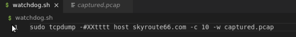
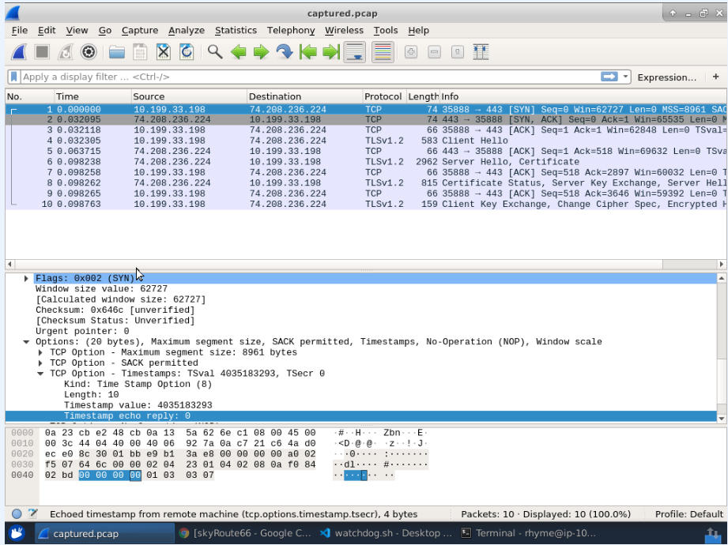
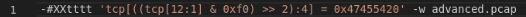
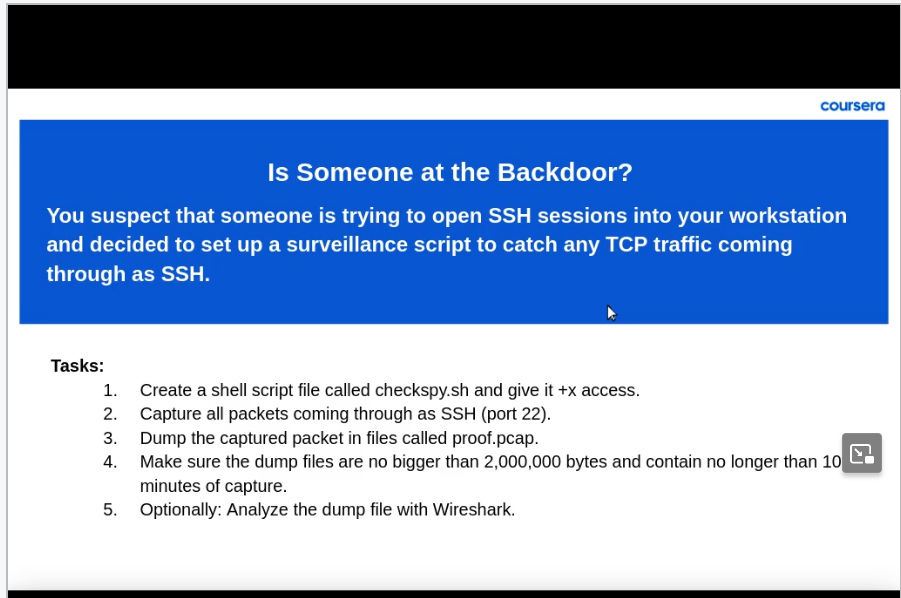
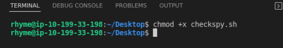
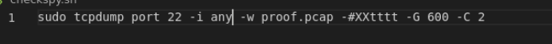
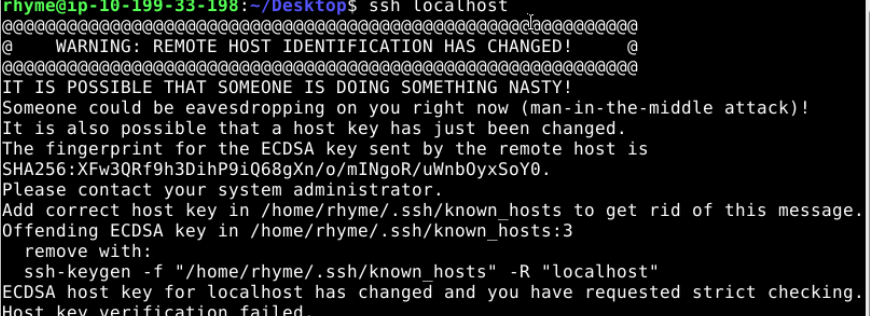
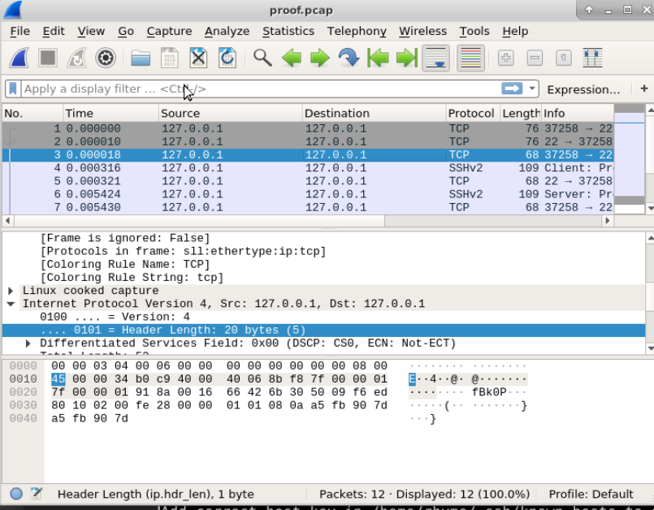

# Project-Analyze-Network-Traffic-With-tcpdump
I guided project implemented on Coursera platform.

Goal of the project is upgrade my skills with tcpdump.

**Task 1 - Warm up**

 Warm up was about trying some commands. Example:

 

 
 

 **Task 2 - Create shell script and explore more options**

 I used a command below to watch traffic for host skyroute66.com

 

 The option "-#tttt" makes the timestamp readable for a human. 
 
 The "-c 10" option limits the number of captured packets to 10 and after capturing these packets in automatically stops execution.

 

 In this case using keyword "and" I was able to filter traffic and get the packets from host skyroute66.com and port 443 (port 443 is for HTTPS protocol).

 Then I moved to Visual Studio Code and created a file "watchdog.sh".

 It was a script to observe for network traffic from a host skyroute66.com

 In Visual Studio Code terminal I changed permissions of the file to executable.

 

 
 

 **Task 3 - Create and read dump files**

 To the script created in previous task I added a part "-w captured.pcap". It makes tcpdump save the results of executing the script in "captured.pcap" file.

 

 After that I opened this file in Wireshark inspect the packets.

Wireshark is one of the best software to inspect packets. It shows a human-readable format and delivers a lot of details. We can see the protocol used in packet, source and final destination of a packet and many more.

 
 

**Task 4 - Create sequence of dump files with size and time limits**

I added the part to my shell script "-C 1 -G 600". 

"-C 1" - creates new file if current file exceeds 1 000 000 bytes.

"-G 600" - file clears itself after 10 minutes.

 
 

**Task 5 -	Advanced expressions for more filtering options**

A little fun fact. This command filters for get request for tcp protocol.

 
 

**Final Task - Culmulative challenge**

I was given a following task:

To complete this exercise I created file "checkspy.sh" and I gave it executable permission:

To meet task's requirements I wrote script:

In shortage, we are listening to port 22 which stands for SSH connections.

We save our work in proof.pcap file. The dump files are no bigger than 2 000 000 bytes and contain no longer than 10 minutes of capture.

Next, I created a ssh connection to catch any traffic.

After catching some packets I put the file into Wireshark to analyze traffic on SSH port.

As we can see, there is some traffic on this port initialized by me. :D 

 
